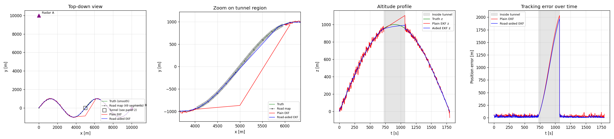

# SDF Tracking Framework

A Python framework for sensor data fusion and target tracking. Built around the
formulations in Koch's *Tracking and Sensor Data Fusion* and Bar-Shalom's
*Estimation with Applications to Tracking and Navigation*. Every component
— motion model, sensor, occlusion model, filter, trajectory, platform —
sits behind a small explicit interface and is plug-compatible with the rest.



The headline scenario: a 3D mountain pass road with a 2.7 km tunnel midway,
two stationary radars at (0, 10 km, 100 m) and (10 km, 0, 100 m), and the
target traversing the road at constant speed. Inside the tunnel both radars
lose the target; a road-aided EKF keeps the cross-track and altitude
estimates close to the manifold while a plain EKF coasts on motion-model
prediction alone and drifts. The error spike during the gap is the
demonstration; the recovery on re-acquisition is the same filter design,
no per-scenario tuning.

> 219 tests passing · Python 3.10+ · MIT license

---

## Quick start

```bash
git clone <repo>
cd sensor-fusion-tracking
pip install -e .

# Run the headline example
python examples/road_with_tunnel.py
# → results/mountain_pass_with_tunnel.png

# Run the full test suite
pytest -v
```

To launch the interactive scenario builder dashboard:

```bash
pip install dash plotly playwright    # not part of the core deps
python -m dashboard                   # serves on http://127.0.0.1:8050
```

## What it does

This framework implements the canonical building blocks of sensor data
fusion, in a way meant to be read as much as run. If you've taken a
tracking course, the names and roles will be familiar; if you haven't,
the inline documentation tries to bridge to the textbook.

The novel pieces are:

- **`TerrainOcclusion` / `TunnelOcclusion`** — a road-aligned tubular
  occlusion model. Anchored to a `PolygonalRoadMap` by arc-length range,
  so the same tunnel definition works on straight and curved roads in 2D
  or 3D. Composes with `DopplerBlindnessOcclusion` via `CompositeOcclusion`.
- **`PolygonalRoadMap`** with explicit per-segment arc length (separate
  from the chord length), so the discretization-error variance σ_d is
  computed correctly when the polygon under-samples a curved road.
- **`RoadAidedExtendedKalmanFilter`** — EKF with a fictitious cross-track
  measurement from the road map applied at every step, regardless of
  whether the sensors fired. The mechanism by which the filter coasts
  through tunnels.
- **An interactive Dash dashboard** (under `dashboard/`) that lets you
  configure the trajectory, sensors, occlusion, filter, and road map
  through forms, run the simulation, and play back the result in 3D with
  a time slider — plus export the playback as an MP4.

## Components

### Motion models (`src/sdf/motion_models/`)

| Class                       | State                              | Dim     | Process noise |
| --------------------------- | ---------------------------------- | ------- | ------------- |
| `ConstantVelocity`          | `[x, vx, y, vy, (z, vz)]`          | 2D / 3D | DWN-A         |
| `ConstantAcceleration`      | `[x, vx, ax, y, vy, ay, ...]`      | 2D / 3D | DWN-J         |
| `CoordinatedTurn`           | `[x, vx, y, vy]`, ω fixed          | 2D      | DWN-A         |
| `CoordinatedTurnUnknown`    | `[x, vx, y, vy, ω]`                | 2D      | DWN-A + ω RW  |

### Sensors (`src/sdf/sensors/`)

- `CartesianPositionSensor` — linear; direct noisy position
- `RadarSensor` — range / bearing / (elevation), with proper angle-wrap on innovation
- `GMTIRadarSensor` — radar + range-rate, supports a moving `Platform`

Each sensor optionally carries an `OcclusionModel`:

- `TunnelOcclusion` — target in a road-aligned tube → no measurement
- `DopplerBlindnessOcclusion` — radial-velocity-dependent P_D suppression
  for GMTI clutter notches
- `CompositeOcclusion` — OR-composition of several models

### Filters (`src/sdf/filters/`)

- `KalmanFilter` — linear measurements only
- `ExtendedKalmanFilter` — local linearization for radar / GMTI
- `RoadAidedExtendedKalmanFilter` — EKF augmented by a road-map cross-track
  measurement, applied per step independently of sensor returns
- `IMMFilter` — Interacting Multiple Models with arbitrary sub-filter list

### Scenarios (`src/sdf/scenarios/`)

- `ConstantVelocityTrajectory`, `MountainPassTrajectory` — analytic truth
- `PolygonalRoadMap` — polygon nodes with surveyed positions, declared σ
  on node coords, and explicit per-segment arc lengths
- Sensor platforms: `StationaryPlatform`, `StraightFlight`, `CircleFlight`,
  `RacetrackFlight` — analytic position and velocity at any t

### Visualization (`src/sdf/viz/`)

- `tunnel_wireframe_segments(tunnel)` — backend-agnostic line geometry
- `draw_tunnel_wireframe(ax, tunnel)` — matplotlib helper for 2D or 3D axes

## Examples

`examples/` contains runnable scripts, each writing a PNG into `results/`:

| Example                              | What it shows                                    |
| ------------------------------------ | ------------------------------------------------ |
| `minimal_kf_2d.py`                   | KF + Cartesian sensor, sanity baseline           |
| `ekf_two_radars_3d.py`               | EKF, 3D CV target, two stationary radars         |
| `mountain_pass_two_radars.py`        | 3D winding road, EKF, no road map                |
| `road_map_aided_tracking.py`         | Same scenario + road-aided EKF for comparison    |
| `road_with_tunnel.py`                | Headline: mountain pass + tunnel, plain vs aided |
| `gmti_with_road_constraint.py`       | GMTI Doppler blindness on a stopping target      |
| `gmti_awacs_road.py`                 | GMTI on AWACS racetrack + 2 radars + road        |
| `imm_aircraft.py`                    | IMM (CV + CT-left + CT-right) on a maneuvering target |

## Dashboard

The interactive dashboard sits in the top-level `dashboard/` directory
(deliberately outside the `sdf` package, to keep Dash and Plotly out of
the core dependency tree). It lets you configure a scenario through form
fields, run it, and watch the playback.


The scenario builder covers trajectory type and parameters, motion model
type and parameters, an add/remove sensor list (each row is its own
sensor type with its own form), occlusion model, filter type, road map
density and node-position uncertainty, plus simulation seed and time step.

Clicking *Run simulation* produces:

- A 3D Plotly scene with truth, estimate, sensors, road map, and tunnel,
  animated frame-by-frame via play/pause and a time slider
- Three side panels: position error vs time, altitude profile, sensor
  detection timeline
- An *Export MP4* button (requires `ffmpeg` on PATH) that writes the
  playback to a downloadable video file

## Known issues

The dashboard's scenario builder is more capable than it is correct.
Specifically, in its current state:

1. The road map is built and visualized when *Enable road map* is checked,
   but the road-aided EKF doesn't fully consume it through the dashboard
   path — runs that work cleanly via `examples/road_with_tunnel.py` show
   2 km drift through the dashboard. The example is the reference;
   the dashboard runner needs an audit.
2. Side panels (error, altitude, detection) don't sync with the 3D
   playback's time slider — they show full time series and don't move
   with playback. Fixing this means combining all panels into one
   Plotly subplots figure so frames are shared.
3. Only `ConstantVelocity` works as the motion model from the dashboard;
   other motion models break at runtime due to state-layout mismatches
   between the trajectory and the filter.
4. Changing the road map's node-position uncertainty (`sigma_nodes`) has
   no observable effect on the tracking error. Most likely a symptom of
   issue 1.
5. The configured scenario parameters aren't displayed under the playback;
   you have to remember what you set.

These are tracked for v7. The core framework (everything under `src/sdf/`)
is verified by the 219-test suite and the example scripts; the dashboard
is a viewer on top of that, and its bugs are in the viewer layer.

## Layout

```
src/sdf/                        Core framework (no Dash dependency)
├── core/                       StateLayout, StateDistribution, Measurement, Track
├── motion_models/              CV, CA, CT (known and unknown ω)
├── sensors/                    Cartesian, Radar, GMTI, occlusion models
├── filters/                    KF, EKF, RoadAidedEKF, IMM
├── scenarios/                  Trajectories, road map, platforms
└── viz/                        Visualization helpers (matplotlib + geometry)

examples/                       Runnable demonstration scripts
tests/                          Framework tests (137, all passing)
dashboard/                      Plotly Dash app — outside the package
├── components/                 Spec-based component registries
├── ui/                         Form generator + playback view
├── tests/                      Dashboard tests (82, all passing)
├── schema.py                   ParameterSpec / ComponentSpec / ComponentChoice
├── simulation.py               Config dict → SimulationResult runner
├── mp4_export.py               matplotlib + ffmpeg MP4 rendering
├── app.py                      Dash app + callbacks
└── __main__.py                 python -m dashboard entry point

results/                        Generated PNGs and MP4s (gitignored content)
```

## Architecture principles

Each layer talks to its neighbours through a single interface. A
`MotionModel` only owes the rest of the framework `f(x, dt)`, `F(x, dt)`,
and `Q(dt)`, plus a `StateLayout` describing which indices are which.
A `Sensor` owes `h(x)`, `H(x)`, and a `measure()` method that handles
detection probability and occlusion uniformly. A `Filter` consumes both
through their interfaces and never knows about ground truth.

`StateLayout` is the small piece of cleverness that holds it together.
It decouples state-vector indices from semantics, so a sensor that needs
"the position part of the state" can ask the layout for `position_idx`
rather than hardcoding `(0, 2)` or `(0, 2, 4)`. This is what makes the
same `Sensor` class work for a 2D CV target and a 3D CA target without
caring about the difference.

Adding a new filter, sensor, motion model, or trajectory is a single
new class implementing its ABC, plus tests; the existing components
don't need to know it exists.

## Attribution

Developed by **Fawwaz Bin Tasneem** (MSc CS, University of Bonn) as a
HiWi portfolio project for **Prof. Wolfgang Koch** (University of Bonn /
Fraunhofer FKIE). The formulations follow Koch's *Tracking and Sensor
Data Fusion* and the framework was developed alongside his SDF course
material.

Built iteratively across six versions; the architecture (state layout,
small interfaces, plug-compatible components) settled around v3 and has
stayed stable since. Each release ran a green test suite end to end.

## License

MIT.

---

<sub>**Publishing to GitHub Pages.** This repository is structured to serve as
its own Pages site: `_config.yml` at the root configures Jekyll with the
`minima` theme, and `README.md` is rendered as the index. To enable, go
to *Settings → Pages*, set Source to *Deploy from a branch*, branch
`main`, folder `/ (root)`. No workflow file is needed.</sub>
