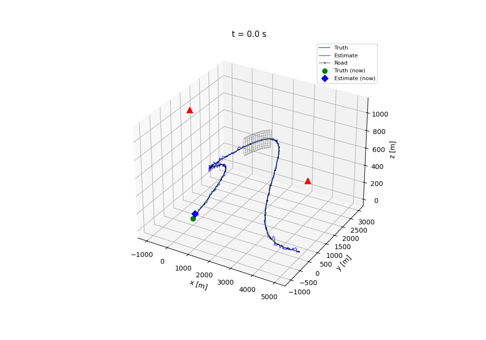
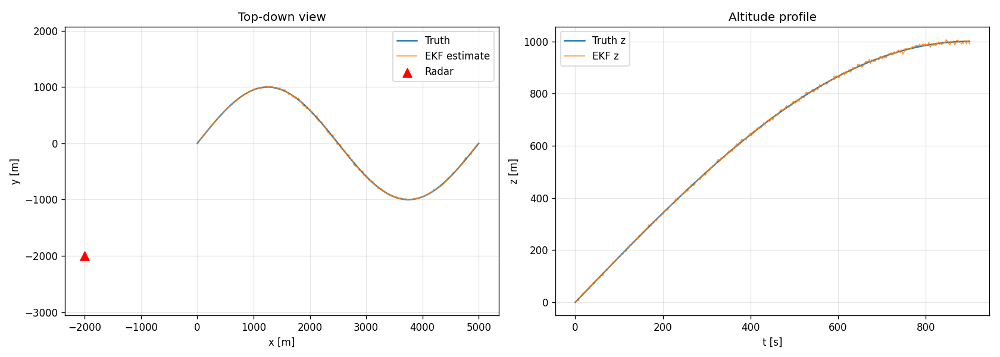
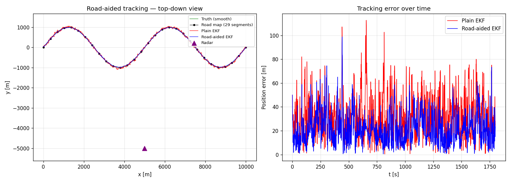
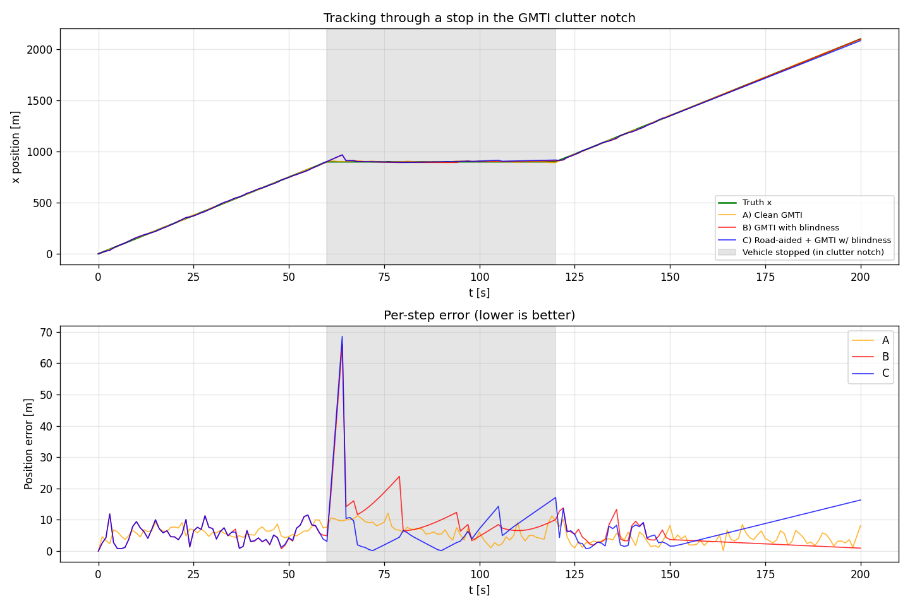
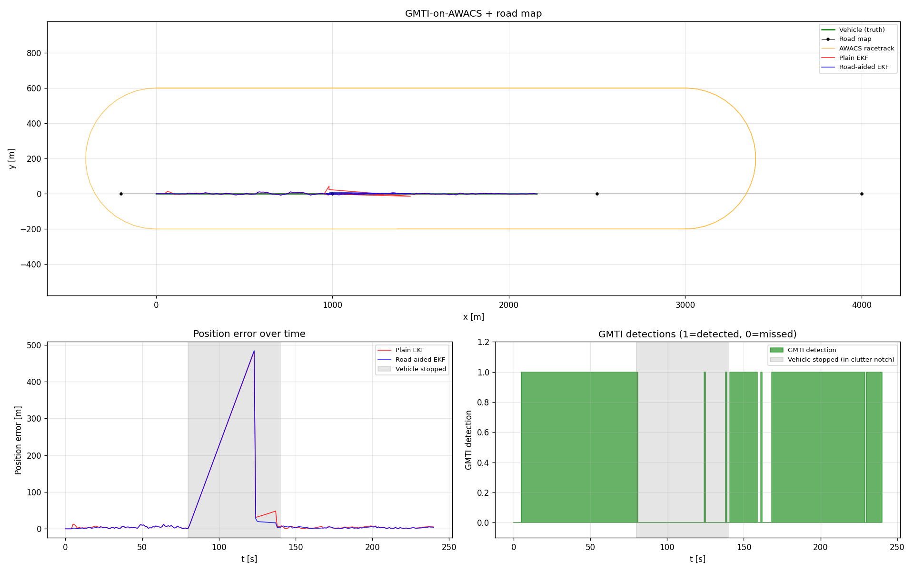
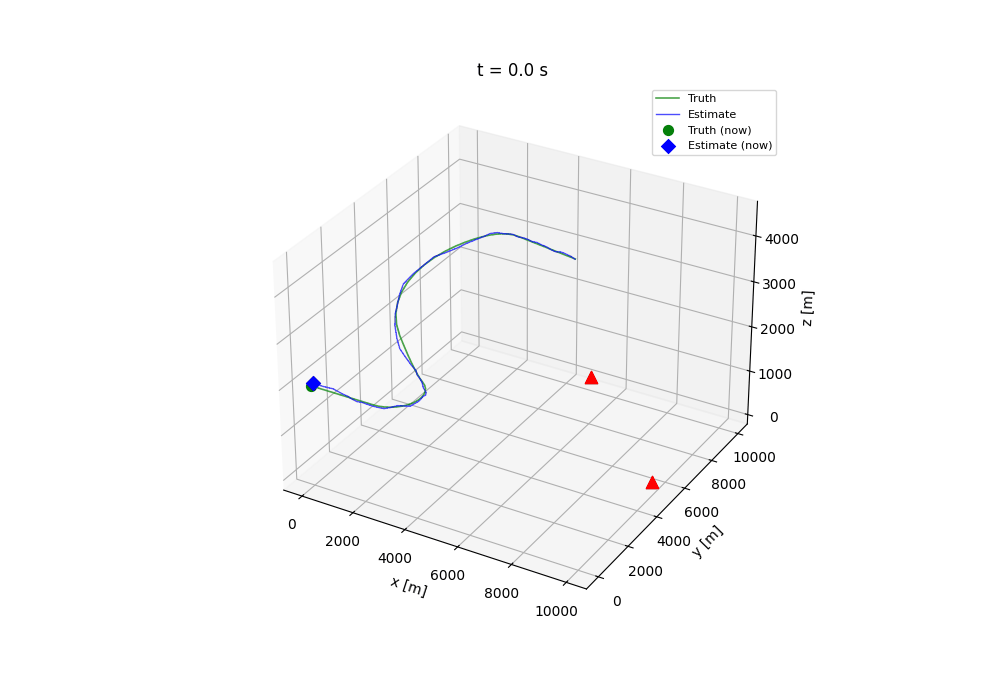
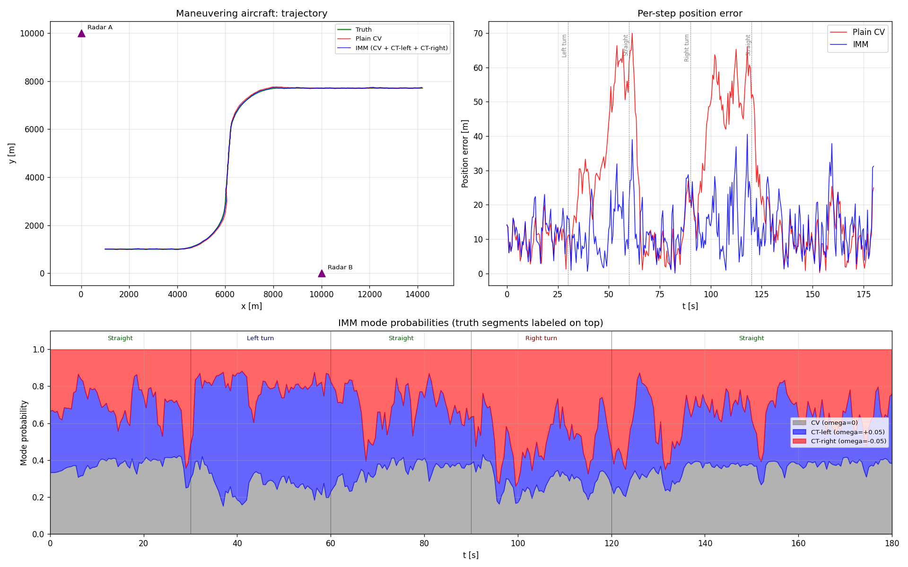

# SDF Tracking Framework

A Python framework for sensor data fusion and target tracking. Built around the
formulations in Prof. Wolfgang Koch's *Tracking and Sensor Data Fusion*. Every
component — motion model, sensor, filter, trajectory, platform — sits behind a
small explicit interface and is plug-compatible with the rest.


 


The headline scenario: a 3D mountain-pass road with a tunnel midway, two
stationary radars, and a target traversing the road. Inside the tunnel both
radars lose the target; with the road map enabled, the road takes over as a
fictitious measurement and keeps the estimate on the road manifold (altitude and
lateral position constrained) while a plain EKF coasts on motion-model
prediction alone and drifts off. Re-acquisition uses the same filter design — no per-scenario
tuning. You can rebuild this end to end in the dashboard (mountain-pass
trajectory + tunnel occlusion + *Enable road map*).

> 459 tests passing · Python 3.10+ · MIT license

---

## Quick start

```bash
git clone <repo>
cd sensor-data-fusion
pip install -e .

# Run an example (writes a PNG into results/)
python examples/mountain_pass_ekf_3d.py
python examples/imm_aircraft.py

# Run the full test suite
pytest -q
```

To launch the interactive scenario builder dashboard:

```bash
pip install dash plotly        # not part of the core deps
python -m dashboard            # serves on http://127.0.0.1:8050
```

The two flagship demos — the **mountain-pass tunnel** (road-aided tracking
through a sensor blackout) and the **fighter-jet IMM** (three motion modes
handing off across hard maneuvers) — are both built in the dashboard; see
*Dashboard* below.

## What it does

This framework implements the canonical building blocks of sensor data fusion,
in a way meant to be read as much as run. If you've taken a tracking course, the
names and roles will be familiar; if you haven't, the inline documentation tries
to bridge to the textbook.

Highlights:

- **Road-map–aided tracking as an occlusion fallback.** A `PolygonalRoadMap`
  with explicit per-segment arc length (separate from the chord length), so the
  discretization-error variance σ_d is computed correctly when the polygon
  under-samples a curved road. The road map is fused as a fictitious
  measurement **only on steps where every sensor misses** (a blackout): the
  predicted position is projected onto the nearest discretized segment, and that
  point is fused with an oriented covariance — low cross-track (pinned to the
  road), high along-track (longitudinal position left loose). The sensors do the
  tracking; the road only takes over to coast the estimate across the gap — the
  mechanism behind the tunnel demo.
- **A three-mode IMM on a unified state.** Constant-velocity, coordinated-turn
  (with an *estimated* turn rate, so one model handles left and right turns),
  and constant-acceleration modes all share one state vector
  `[x, vx, ax, y, vy, ay, (z, vz, az,) ω]`, so the IMM mixes them directly — in
  2D **or** 3D. The dashboard shows the live mode probabilities, so you can
  watch the filter decide which dynamics the target is in.
- **Occlusion as a first-class, composable concept.** `TunnelOcclusion`
  (a road-aligned tube, anchored by arc-length so it works on straight or curved
  roads in 2D/3D), `DopplerBlindnessOcclusion` (the GMTI clutter notch), and
  `CompositeOcclusion` (OR-composition) all plug into the same sensor pipeline.
- **An azimuth-only radar** (range + bearing, *no* elevation): a classic 2D
  surveillance radar whose measurements are independent of height, so altitude
  is genuinely unobservable from it — a clean motivation for road-aided altitude
  tracking.
- **A moving GMTI platform** with selectable flight patterns (straight, circle,
  racetrack), whose motion shifts the Doppler clutter notch.
- **An interactive Dash dashboard** that lets you configure the scenario through
  forms, run it, and play it back in 3D — with evaluation metrics (RMSE, ANEES
  consistency), IMM mode probabilities, and the ground-truth clutter notch
  plotted alongside.

## Components

### Motion models (`src/sdf/motion_models/`)

| Class                       | State                                    | Dim     | Process noise |
| --------------------------- | ---------------------------------------- | ------- | ------------- |
| `ConstantVelocity`          | `[x, vx, y, vy, (z, vz)]`                | 2D / 3D | DWN-A         |
| `ConstantAcceleration`      | `[x, vx, ax, y, vy, ay, …]`              | 2D / 3D | DWN-J         |
| `CoordinatedTurn`           | `[x, vx, y, vy]`, ω fixed                | 2D      | DWN-A         |
| `CoordinatedTurnUnknown`    | `[x, vx, y, vy, ω]`                      | 2D      | DWN-A + ω RW  |
| `UnifiedCV / CA / CT`       | shared `[…, ax, ay, (az,) ω]`            | 2D / 3D | per mode      |

The `Unified*` set is the IMM bank: all three share one `StateLayout` so they
mix cleanly. Each mode uses the components it models and zeros the rest (CV zeros
acceleration and ω; CA zeros ω; CT does a horizontal coordinated turn at ω with
the vertical axis under constant velocity).

### Sensors (`src/sdf/sensors/`)

- `CartesianPositionSensor` — linear; direct noisy position (the one sensor
  valid with the plain `KalmanFilter`)
- `RadarSensor` — range / bearing / (elevation), with proper angle-wrap on the
  innovation
- `AzimuthOnlyRadarSensor` — range + bearing only, no elevation; altitude
  unobservable
- `GMTIRadarSensor` — radar + range-rate; rides a moving `Platform` and keeps an
  attached Doppler notch in sync with its own motion

Each sensor optionally carries an `OcclusionModel`:

- `TunnelOcclusion` — target inside a road-aligned tube → no measurement
- `DopplerBlindnessOcclusion` — radial-velocity-dependent P_D suppression (the
  GMTI clutter notch)
- `CompositeOcclusion` — OR-composition of several models

### Filters (`src/sdf/filters/`)

- `KalmanFilter` — linear measurements only
- `ExtendedKalmanFilter` — local linearization for radar / GMTI / azimuth radar
- `RoadAidedExtendedKalmanFilter` — EKF augmented by a road-map fictitious
  measurement (the predicted position projected onto the nearest segment, fused
  with low cross-track / high along-track covariance; also exposed as the
  standalone `road_cross_track_update`, which the dashboard applies to whichever
  filter you choose, only on steps where every sensor misses)
- `IMMFilter` — Interacting Multiple Models over an arbitrary sub-filter list;
  the dashboard wires it as the unified CV + CT + CA bank

### Scenarios (`src/sdf/scenarios/`)

- `ConstantVelocityTrajectory` (2D/3D), `MountainPassTrajectory` (3D),
  `FighterJetTrajectory` (2D/3D) — analytic truth
- `FighterJetTrajectory` flies level → hard left break → accelerate + zoom climb
  → harder right break → decelerate + dive → level: the maneuver bank that makes
  a single motion model fail and the IMM shine
- `PolygonalRoadMap` — polygon nodes with surveyed positions, declared σ on node
  coords, and explicit per-segment arc lengths
- Sensor platforms: `StationaryPlatform`, `StraightFlight`, `CircleFlight`,
  `RacetrackFlight` — analytic position and velocity at any t

### Visualization (`src/sdf/viz/`)

- `tunnel_wireframe_segments(tunnel)` — backend-agnostic line geometry
- `draw_tunnel_wireframe(ax, tunnel)` — matplotlib helper for 2D or 3D axes

## Dashboard

The interactive dashboard sits in the top-level `dashboard/` directory
(deliberately outside the `sdf` package, to keep Dash and Plotly out of the core
dependency tree). It assembles a scenario from form fields, runs it, and plays
it back.

The scenario builder covers:

- **Trajectory** — mountain pass (3D), constant velocity (2D/3D), or fighter jet
  (2D/3D)
- **Motion model** — CV / CA / CT (ignored when the IMM filter is selected,
  which defines its own bank)
- **Sensors** — an add/remove list; each row is its own type (Cartesian, radar,
  azimuth-only radar, GMTI) with its own form. A GMTI row can ride a **flight
  pattern** (stationary / straight / circle / racetrack).
- **Occlusion** — none, tunnel, or Doppler clutter notch
- **Filter** — KF, EKF, or the three-mode IMM
- **Road map** — enabling it turns on road-aided filtering (a fictitious
  road-segment measurement, fused only when every sensor misses) and positions
  any tunnel; node count and σ are adjustable
- **Simulation** — seed and time step

Clicking *Run simulation* produces a 3D Plotly scene (truth, estimate, sensors,
road map, tunnel; sensors animate if they're on a moving platform) plus side
panels:

- a **metrics table** — RMSE (overall / horizontal / vertical / per-axis),
  velocity RMSE, mean/max/final error, **ANEES** consistency (over-confident /
  consistent / over-cautious), and detection rate
- **position error vs time** (with the RMSE drawn as a reference line)
- **altitude** (truth vs estimate)
- **sensor detection** timeline
- **IMM mode probabilities** (when the IMM is selected) — the CV / CT / CA bands
  handing off across a maneuver
- **clutter notch ground truth** (when a Doppler occlusion is present) — the
  true detection factor over time with every missed scan marked, so dropouts
  line up with the notch

Invalid configurations fail with a clear message (e.g. a linear KF on a
nonlinear sensor warns rather than silently diverging; a dimension mismatch says
exactly what to change; a blank form field names itself). An *Export MP4* button
(requires `ffmpeg` on PATH) writes the playback to a downloadable video.

## Examples

`examples/` contains runnable scripts; most write a PNG into `results/`:

| Example                         | What it shows                                      |
| ------------------------------- | -------------------------------------------------- |
| `minimal_kf_2d.py`              | KF + Cartesian sensor, sanity baseline             |
| `ekf_radar_2d.py`               | EKF + a single radar, 2D                            |
| `ekf_two_radars_3d.py`          | EKF, 3D CV target, two stationary radars           |
| `mountain_pass_ekf_3d.py`       | 3D winding road, EKF, two radars                   |
| `road_map_2d.py`                | Road-aided EKF on a 2D road                         |
| `gmti_road_2d.py`               | GMTI range-rate tracking on a 2D road              |
| `gmti_with_road_constraint.py`  | GMTI Doppler blindness on a stopping target        |
| `gmti_awacs_road.py`            | GMTI on an AWACS racetrack + 2 radars + road       |
| `imm_aircraft.py`               | IMM on a maneuvering aircraft                       |

The figures below are produced by these scripts (re-run them to regenerate the
PNGs in `results/`).

**`mountain_pass_ekf_3d.py` — 3D winding road, EKF, single radar.** A CV-model
EKF tracks a sinusoidal mountain road in plan view and altitude; the radar sees
range/bearing/elevation, so altitude stays observable and the estimate hugs the
truth.



**`road_map_2d.py` — road-aided EKF on a 2D road.** The same target tracked with
and without the road map. This example deliberately applies the road constraint
*every step* (the radar detects continuously) to isolate the bare cross-track
mechanism; pinning to the road manifold pulls the per-step error down (mean ≈ 21 m
vs ≈ 32 m for the plain EKF). The operational policy elsewhere — dashboard and
the GMTI examples below — fuses the road only when the sensors return nothing.



**`gmti_road_2d.py` — GMTI range-rate tracking through a stop.** When the target
halts inside the GMTI clutter notch its radial velocity vanishes and detections
drop out (grey band). The plain EKF coasts and spikes; the road-aided variant
(C) stays constrained to the road through the blackout. (`gmti_with_road_constraint.py`
runs the same comparison.)



**`gmti_awacs_road.py` — GMTI on an AWACS racetrack + road map.** A GMTI sensor
riding an orbiting AWACS platform tracks a road-bound vehicle. During the stop
(grey band) the moving platform's Doppler notch suppresses detections; error
climbs and then re-acquires once the vehicle moves again.



**`imm_aircraft.py` — IMM on a maneuvering aircraft.** A three-mode IMM
(CV / CT / CA) tracks a jet through straight, left-turn, and right-turn segments.
The bottom panel shows the mode probabilities handing off across each maneuver;
the IMM roughly halves the plain-CV error (mean ≈ 13 m vs ≈ 22 m).



## Limitations

The dashboard's side panels show the full time series; they do not yet scrub in
lock-step with the 3D playback's time slider. The configured scenario parameters
also aren't echoed under the playback. These are viewer conveniences, not
correctness issues — every combination of options runs and is validated (see the
combination test below).

## Layout

```
src/sdf/                        Core framework (no Dash dependency)
├── core/                       StateLayout, StateDistribution, Measurement, Track
├── motion_models/              CV, CA, CT (known/unknown ω), unified CV/CT/CA
├── sensors/                    Cartesian, Radar, AzimuthRadar, GMTI, occlusion
├── filters/                    KF, EKF, RoadAidedEKF, IMM
├── scenarios/                  Trajectories (incl. fighter jet), road map, platforms
└── viz/                        Visualization helpers (matplotlib + geometry)

examples/                       Runnable demonstration scripts
tests/                          Framework tests (191)
dashboard/                      Plotly Dash app — outside the package
├── components/                 Spec-based component registries
├── ui/                         Form generator + playback view
├── tests/                      Dashboard tests (268, incl. an exhaustive
│                               option-combination harness)
├── schema.py                   ParameterSpec / ComponentSpec / ComponentChoice
├── simulation.py               Config dict → SimulationResult runner
├── mp4_export.py               matplotlib + ffmpeg MP4 rendering
├── app.py                      Dash app + callbacks
└── __main__.py                 python -m dashboard entry point

results/                        Generated PNGs (MP4s gitignored)
```

## Architecture principles

Each layer talks to its neighbours through a single interface. A `MotionModel`
only owes the rest of the framework `f(x, dt)`, `F(x, dt)`, and `Q(dt)`, plus a
`StateLayout` describing which indices are which. A `Sensor` owes `h(x)`, `H(x)`,
and a `measure()` method that handles detection probability and occlusion
uniformly. A `Filter` consumes both through their interfaces and never knows
about ground truth.

`StateLayout` is the small piece of cleverness that holds it together. It
decouples state-vector indices from semantics, so a sensor that needs "the
position part of the state" can ask the layout for `position_idx` rather than
hardcoding `(0, 2)` or `(0, 2, 4)`. This is what makes the same `Sensor` class
work for a 2D CV target and a 3D CA target — and what lets the unified IMM bank
mix three different dynamics in one vector.

Adding a new filter, sensor, motion model, or trajectory is a single new class
implementing its ABC, plus tests; the existing components don't need to know it
exists. The dashboard's exhaustive combination test runs (almost) every
trajectory × motion model × sensor × occlusion × filter × road-map combination
at default parameters and validates each result against independently recomputed
expectations, so a fix in one option can't silently break another.

## Disclaimer

AI tools such as Gemini and Claude were used in the development of this project.

## Attribution

Developed by **Fawwaz Bin Tasneem** (MSc CS, University of Bonn) as a portfolio
project, extending the work done as a part of the course **Introduction to
Sensor Data Fusion**.

The architecture (state layout, small interfaces, plug-compatible components)
settled early and has stayed stable; each release ran a green test suite end to
end.

## License

MIT.

---

<sub>**Publishing to GitHub Pages.** This repository is structured to serve as
its own Pages site: `_config.yml` at the root configures Jekyll with the
`minima` theme, and `README.md` is rendered as the index. To enable, go to
*Settings → Pages*, set Source to *Deploy from a branch*, branch `main`, folder
`/ (root)`. No workflow file is needed.</sub>
